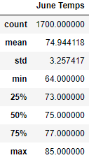

# Surfs Up

## Overview

### Purpose
W.Avy is interested in sponsoring us to create a new surf shop in hawaii and after giving data about precipitation and weather in the area we want to set up shop, he wants more information about temperature trends before opening the surf shop, specifically in June and December in Oahu.

## Results

* The max temperatues in both summaries are not very far apart with a difference of 2 degrees
* The average also are similar temparatures with a difference of three degrees
* the minimum in december has a noticeable difference of 8 degrees

## Summary
According to the data, both December and June have temperatures that are not very far apart from each other, where december may have have a few days that are noticeably colder than June. The slight difference of the overall temparatures make it seem like the temparatures are fairly stable throughout the year. 2 additional queries I would make are to see how often in the two months the temperatures are in the colder side and how often the temperature reaches the higher sides. 
